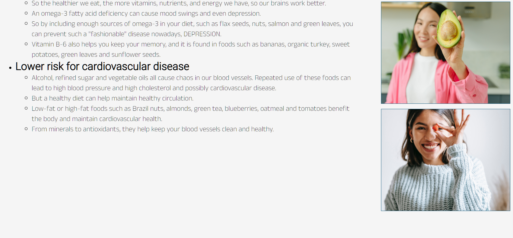
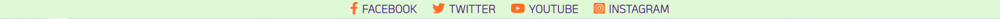
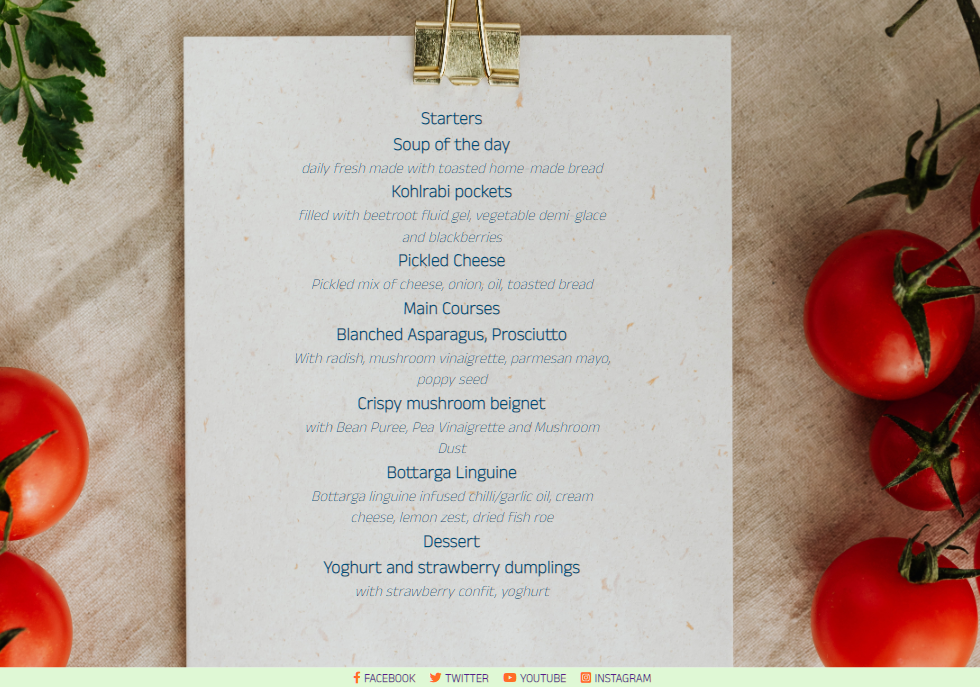
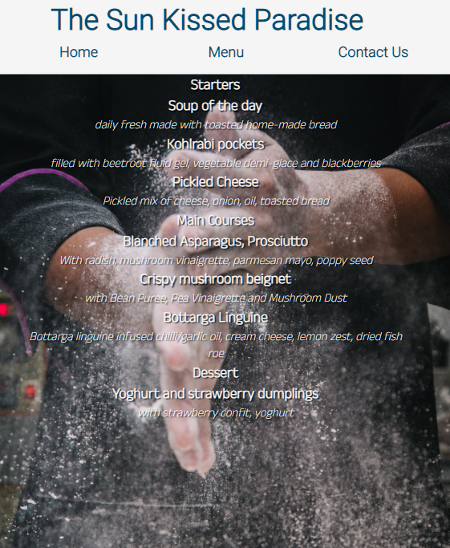

# The Sun Kissed Paradise

## We offer most trendy and fast-growing cuisine concept focused on longevity – with mostly plant based menu and using principles of Blue Zones longevity, Nordic and Mediterranean diet. Concept is perfectly suited for people interested in health-longevity, fitness, vegan, vegetarian, organic, sustainable, green, keto food.

## Feautures

* _Nav Bar_

    * Featured on all three pages, the full responsive navigation bar includes links to the Home page, Menu and Contact Us page and is identical in each page to allow for easy navigation.
    * This section will allow the user to easily navigate from page to page across all devices without having to revert back to the previous page via the ‘back’ button.
    * Containing an eye catching animation to grab the users attention, when hovered over it changes its color from blue to orange.

* _The landing page image_

    * The landing includes an image with text overlay containing a quote about eating by François de la Rochefoucauld.

* _The Reasons_ 

    * In the reasons section the user will see the benefits of having a clean and healthy lifestyle.
    * It contains a list with 4 main reasons and also 4 images.

* _The Footer_

    * The footer section includes links to the relevant social media sites for _The Sun Kissed Paradise_. The links will open to a new tab to allow easy navigation for the user.

    * The footer is valuable to the user as it encourages them to keep connected via social media.

* _The Menu_

    * The menu will provide the user with the list of dishes to be served.
    * The menu is divided into three sections representing the starters, the mains and the dessert options.
    * All dishes on the menu are provided with a brief description.
    * The background image will change for larger to medium screens size from 1200px wide and down.

* _Contact Us_

    * This page will allow the user to get in touch with us. The user will be able to fill in a text area and also to resize the text area. The user will be asked to submit their full name and email address.

## Validator Testing

* HTML
    * No errors were returned when passing through the official W3C validator
* CSS
    * No errors were found when passing through the official (Jigsaw) validator

## Deployment

* The site was deployed to GitHub pages. The steps to deploy are as follows:
    * In the GitHub repository, navigate to the Settings tab
    * From the source section drop-down menu, select the Master Branch
    * Once the master branch has been selected, the page will be automatically refreshed with a detailed ribbon display to indicate the successful deployment.

The live link can be found here - https://gabrielsiket.github.io/the-sun-kissed-paradise/contact.html

## Credits

* Content

    * The text for the Home page was taken from https://ioanaginghina.ro/5-motive-pentru-a-manca-sanatos/
    * Instructions on how to implement form validation on the Sign Up page was taken from https://www.w3schools.com/
    * The icons in the footer were taken from Font Awesome

* Media

    * The photos used on the home and sign up page are from https://www.pexels.com/

